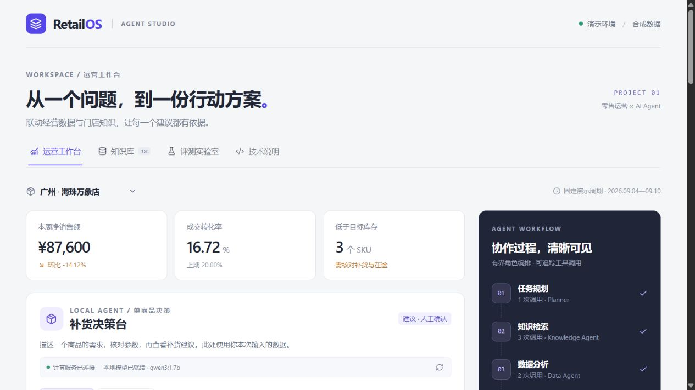
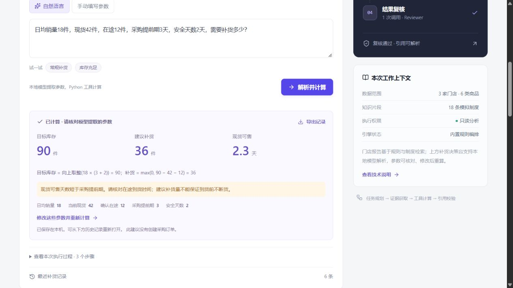
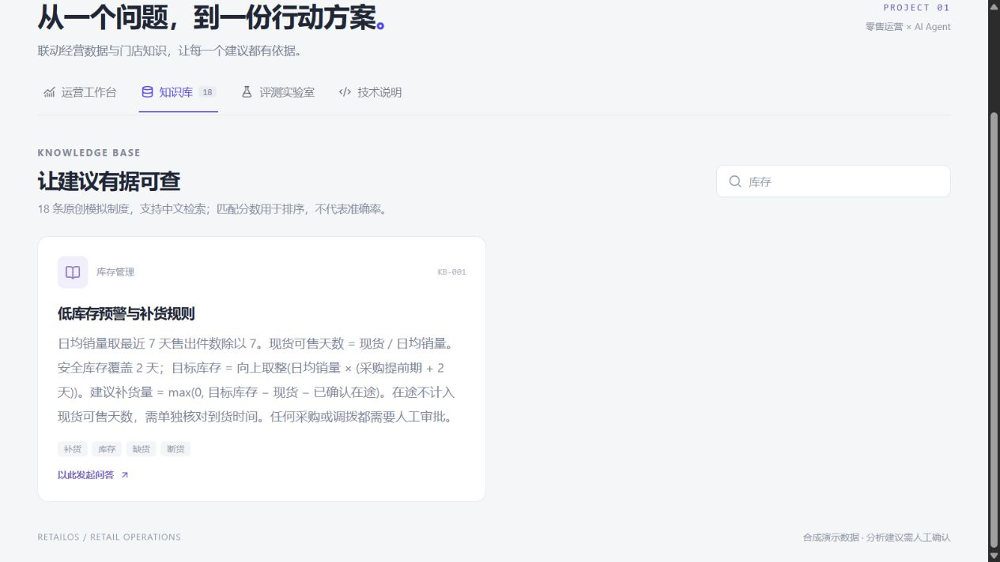
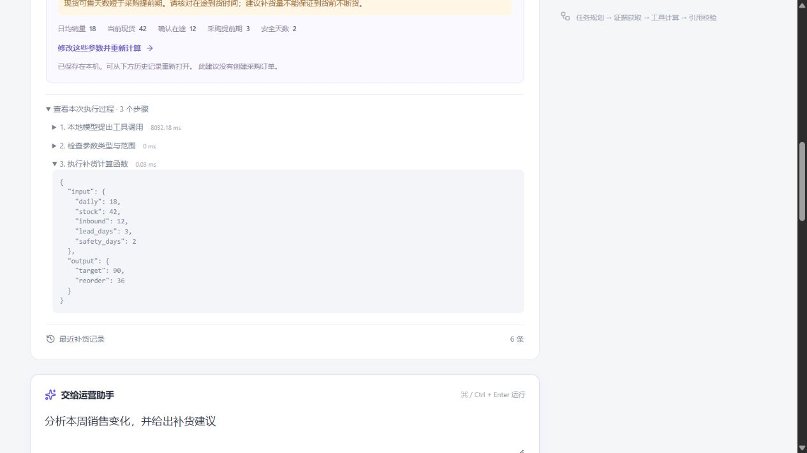
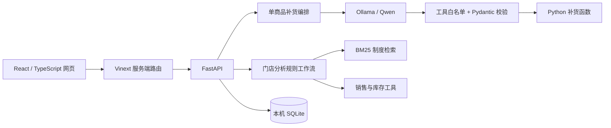

# RetailOS

**可核对、可追溯的零售运营助手**

把门店经营分析、制度检索与自然语言补货放在一个工作台中。模型负责把问题转换成工具参数；业务数字由 Python 函数计算，执行输入、输出和来源可查看。

> 所有门店、商品和制度均为原创合成演示数据。模型运行在本地 Ollama，无需付费模型 API。系统生成建议，不连接真实采购、改价或退款系统。

## 界面预览

工作台汇总门店经营指标，并提供单商品补货入口与流程概览。以下截图来自本地实际运行，使用合成演示数据。



<details>
<summary>场景一：自然语言补货与参数核对</summary>

输入日均销量 18 件、现货 42 件、在途 12 件、采购提前期 3 天和安全天数 2 天。模型提取参数后，Python 函数计算出目标库存 90 件、建议补货 36 件；界面同时展示公式、参数与断货风险提示。



</details>

<details>
<summary>场景二：检索门店制度</summary>

搜索“库存”，查看匹配的模拟制度、原文和来源编号，并可基于该制度继续发起问答。



</details>

<details>
<summary>场景三：追溯模型与工具执行过程</summary>

展开执行记录，查看模型提出调用、程序检查参数、函数计算三个步骤。计算函数的输入与输出可直接核对。



</details>

## 可以做什么

| 功能           | 行为                                                                           |
| -------------- | ------------------------------------------------------------------------------ |
| 补货决策台     | 用自然语言描述日销、现货、在途和交期，本地模型提出工具调用，程序验证参数并计算 |
| 参数核对与重算 | 查看提取的五项参数，修改后直接重算；模型不可用时可手动填写                     |
| 补货记录       | SQLite 保存计算记录，支持重新打开和导出 JSON；每次保留真实工具输入与输出       |
| 门店经营分析   | 切换三家模拟门店，计算销售环比、转化率、客单价和六种商品的库存风险             |
| 制度检索       | 18 条模拟制度，中文 BM25 + 关键词检索，展示原文、编号与匹配依据                |
| 执行追踪       | 查看任务路由、检索结果、工具调用和引用校验；导出分析报告                       |
| 检索回归       | 32 条固定用例对比关键词基线与 BM25，逐条显示结果                               |

例如输入“日均销量18件，现货42件，在途12件，采购提前期3天，安全天数2天”，计算结果为目标库存90件、建议补货36件。把现货改为100件，建议补货变为0件。

## 架构



补货流程每次只允许一次 `calculate_replenishment` 工具调用。模型不能执行任意代码；程序核对工具名、类型和数值范围后调用函数。最终关键数字直接来自函数，不再请求模型改写。

门店分析采用预定义 Planner → Knowledge → Data → Reviewer 角色编排。这些是代码中的工作流步骤，不是多个自主大模型。未配置 Python 后端时，网页可使用 TypeScript 规则引擎演示门店分析；自然语言补货和持久化记录需要 Python。

## 本地启动

环境：Node.js 22.13+、Python 3.11+。完整模型功能还需要安装 Ollama 和支持工具调用的本地模型。

首次安装，在项目根目录执行：

```powershell
npm ci
python -m venv .venv
.\.venv\Scripts\python.exe -m pip install -r requirements.lock.txt
```

使用自然语言功能时，打开 Ollama，并下载模型（只需一次）：

```powershell
ollama pull qwen3:1.7b
```

**Windows：双击 `启动完整项目.cmd`。** 启动器检查依赖和端口，建立本地后端配置，启动后台服务，就绪后打开网页。重复启动会复用已运行服务。无需模型的门店分析和手动计算也可独立使用。

以下地址仅在本机启动项目后有效，不是公开在线演示链接。

- 网页：[http://localhost:3000](http://localhost:3000)
- Python 接口文档：[http://127.0.0.1:8000/docs](http://127.0.0.1:8000/docs)
- `检查项目.cmd`：查看服务是否连接。
- `停止项目.cmd`：只停止由启动器创建且进程身份一致的服务，不停止 Ollama。
- 日志：`outputs/web-error.log`、`outputs/backend-error.log`。本机日志、模型和数据库不提交到 Git。

<details>
<summary>手动启动与配置</summary>

在 `.env.local` 中添加以下内容，网页服务会读取它。不要只在 PowerShell 设置同名变量：

```dotenv
AGENT_BACKEND_URL=http://127.0.0.1:8000
```

终端一：

```powershell
.\.venv\Scripts\python.exe -m uvicorn backend.api:app --host 127.0.0.1 --port 8000
```

终端二：

```powershell
npm run dev
```

模型默认使用 `qwen3:1.7b`，Ollama 默认地址为 `http://127.0.0.1:11434`。更换模型时，在启动 Python 的终端设置 `OLLAMA_MODEL`、`OLLAMA_BASE_URL`。报告补充摘要是单独的可选功能，需要显式设置 `OLLAMA_SUMMARY=1`，默认关闭。

浏览器地址栏发送 GET；`/api/chat` 和补货接口需要 POST，不能通过直接打开接口地址完成调用。请使用工作台或 FastAPI 文档的 Try it out。

</details>

## API

| 方法与路径（Python 服务）           | 用途                                                                  |
| ----------------------------------- | --------------------------------------------------------------------- |
| `GET /api/health`                   | 服务健康检查                                                          |
| `GET /api/services`                 | 检查 Ollama 连接和模型是否安装，不发起推理                            |
| `POST /api/replenishment`           | 请求模型解析并计算，正文 `{"query":"…"}`                              |
| `POST /api/replenishment/calculate` | 根据五项结构化参数直接计算                                            |
| `GET /api/replenishment/history`    | 最近十条补货记录                                                      |
| `POST /api/run`                     | 门店分析，正文 `{"query":"分析销售并给出补货建议","storeId":"GZ001"}` |
| `GET /api/knowledge?q=验收`         | 制度检索                                                              |
| `POST /api/evaluate`                | 检索回归                                                              |
| `GET /api/runs?storeId=GZ001`       | 指定门店的分析记录                                                    |

结构化计算示例：

```json
{ "daily": 18, "stock": 42, "inbound": 12, "lead_days": 3, "safety_days": 2 }
```

## 检查

```powershell
.\.venv\Scripts\python.exe -m unittest discover -s tests -v
npm run lint
npm run typecheck
npm run build
# 网页服务运行后
npm run test:api
```

测试覆盖公式取整、在途扣减、非法参数、工具白名单、模型无调用与异常响应、服务超时、手动计算绕过模型、历史记录与存储失败。模型响应使用测试替身；这些测试验证系统处理逻辑，不评价模型回答质量。

检索实验包含28条有标准引用的问题和4条边界问题。它是随项目维护的固定回归集，不是独立测试集；Recall@3 不代表真实门店效果。评测页面保留未通过项。

## 源码导航

| 路径                                 | 内容                                 |
| ------------------------------------ | ------------------------------------ |
| `app/replenishment-panel.tsx`        | 补货输入、参数修订、结果和历史       |
| `app/api/`                           | 网页服务端 API 与 Python 转发        |
| `backend/api.py`                     | FastAPI 路由和请求模型               |
| `backend/replenishment_agent.py`     | 本地模型请求、工具调用校验与流程记录 |
| `backend/replenishment.py`           | 纯补货计算函数                       |
| `backend/agent.py`、`backend/rag.py` | 经营分析编排与中文检索               |
| `backend/storage.py`                 | 本地 SQLite 记录                     |
| `lib/engine.ts`                      | 无 Python 时的网页规则引擎           |
| `data/retail.json`                   | 合成数据、模拟制度、回归用例         |
| `skills/`、`prompts/`                | 技能说明、独立调用入口、提示词       |
| `scripts/local.py`                   | 本地启动、状态与停止管理             |

## 当前边界

这是可运行的本地演示应用。没有实时 ERP 数据、账号权限体系、采购执行或需求预测。补货按稳定日均销量计算；在途到货时间、节假日需求需要人工核对。

参数校验保证类型与范围合法，不证明模型理解正确；因此界面保留参数核对和手动重算。知识检索采用词法 BM25，没有向量数据库；引用可解析不等同于语义已验证。

上传 GitHub 会公开源代码，不会让本机 Ollama 自动变成在线服务。其他人可以按上述步骤本地运行；公开运行中的网站需要另行部署。
